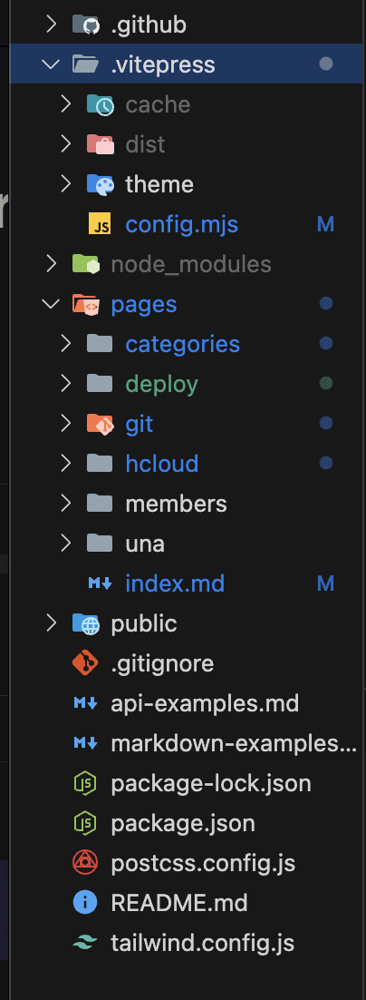
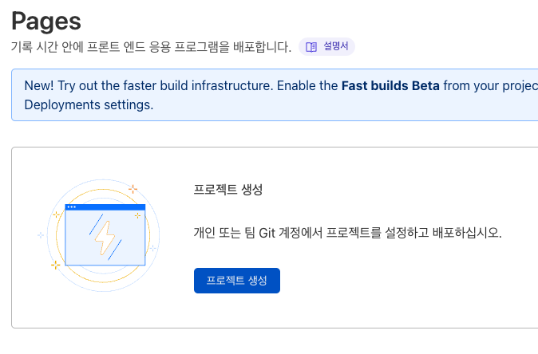
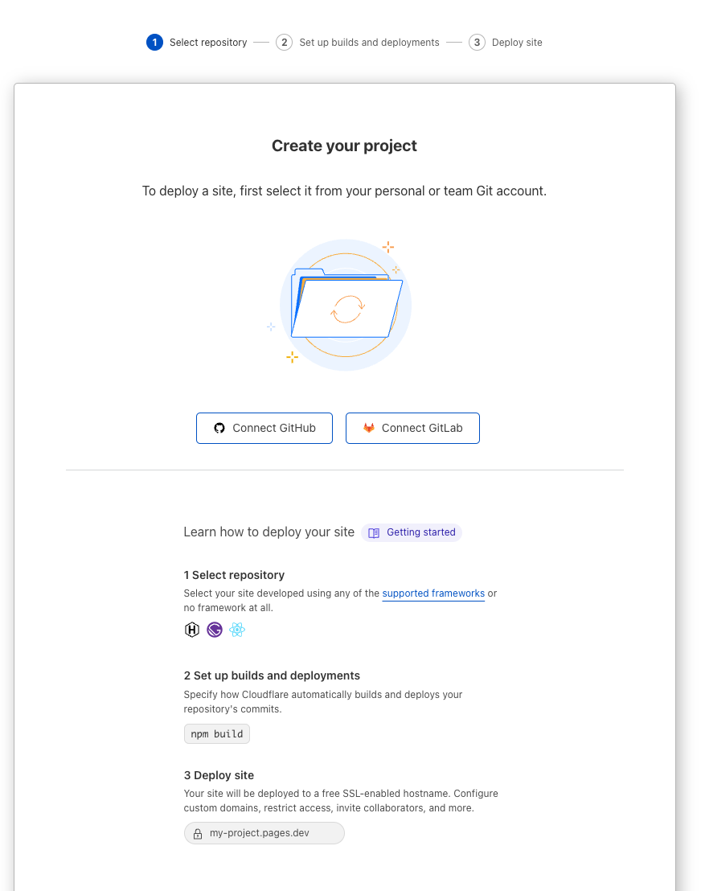
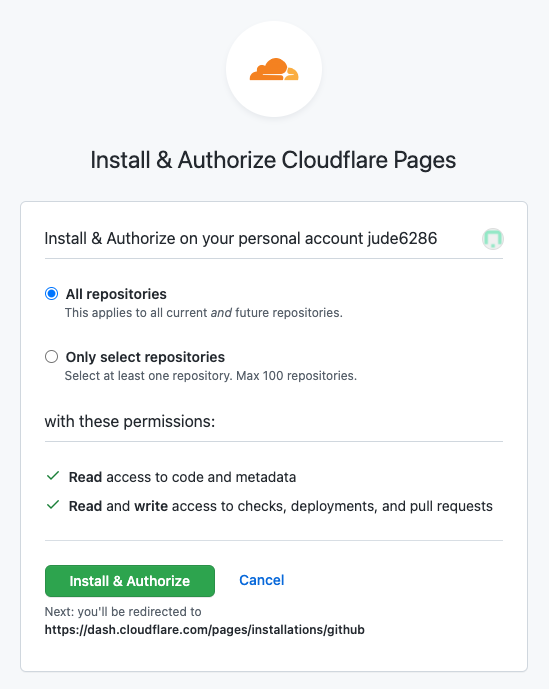
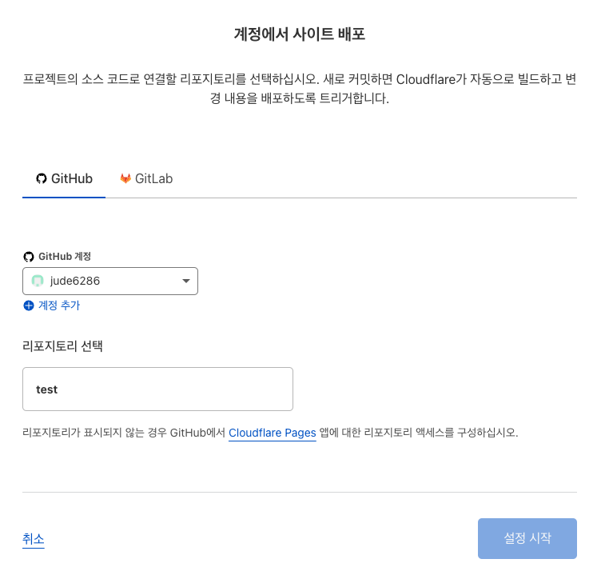
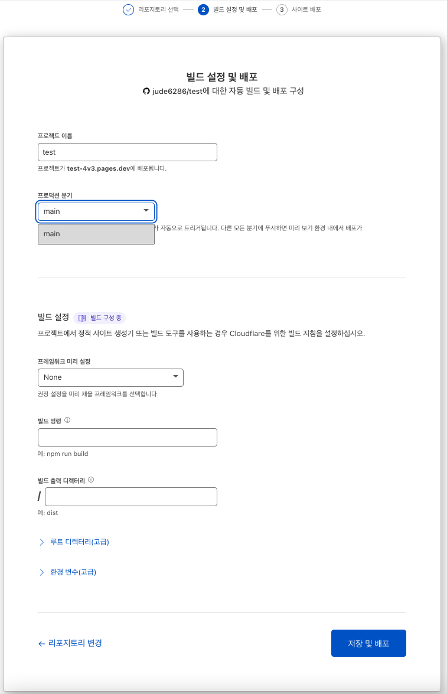
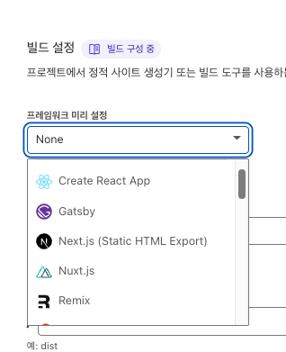
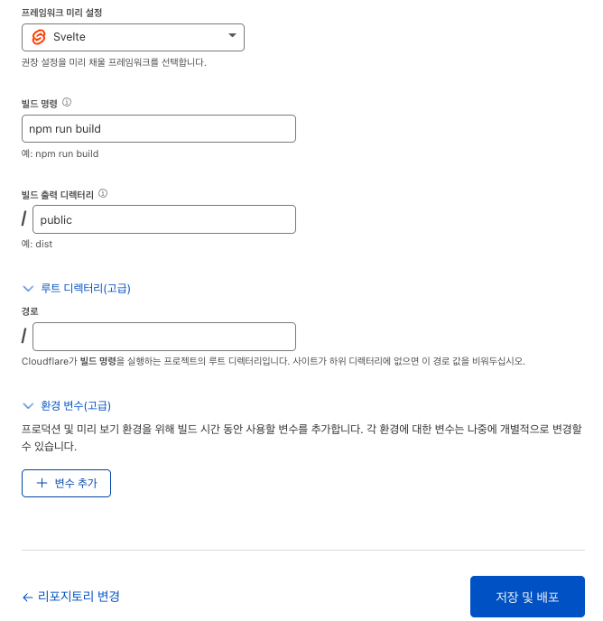
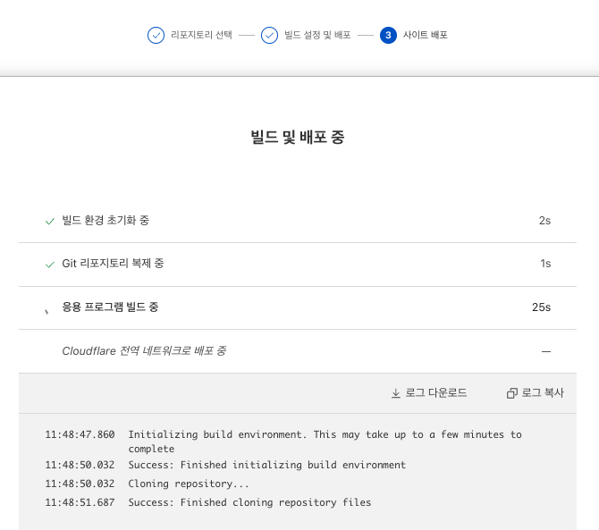
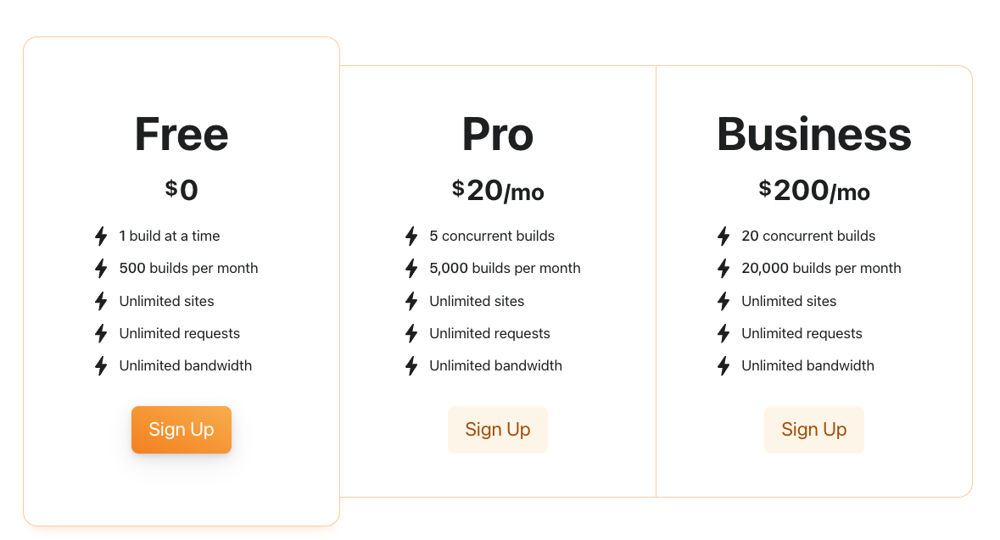

---
author: 조미혜
title: vitepress 와 cloudflare 로 배포하기
thumbnail: thumbnail.jpg
refer: https://github.com/KangBit/kangbit.github.io
tags: [Git]
layout: article
sidebar: false
created: 2024.08.02 12:30:00
avatar: true
---  

## vitepress 로 github-page 에 action으로 배포하기 
------------------
#### 1. pages 구조로 작성하기
 

위와 같은 페이지 구조로 작업하다보면
경로 문제가 생기는 경우가 발생한다.

그럴경우 아래의 코드를 꼭 적어야 한다.
 
 ```
 //.vitepress/config.mjs
 
 rewrites: {
    "pages(/:path)*/(.*)": "(/:path)*/(.*)",
  },
 ```

####  2. vitepress 로 배포 테스트하기
vitepress 로 배포 시 `npm run docs:preview` 로 테스트를 먼저 해본다,
.vitepress 의 dist 파일이 있어야만 가능,,
`npm run docs:build` 를 먼저 해볼 것

#### 3. .github workflows 로 action 생성하기

deploy.yml 파일 생성
1) build 하기
2) deploy 하기
> 
```js{4}
# GitHub Pages에 VitePress 사이트를 빌드하고 배포하기 위한 샘플 워크플로우
#
name: Deploy VitePress site to Pages

on:
  # `main` 브랜치를 대상으로 하는 푸시에 대해 실행합니다. 기본 브랜치로 `master`를
  # 사용하는 경우, 이를 `master`로 변경하세요.
  push:
    branches: [main]

  # Actions 탭에서 이 워크플로우를 수동으로 실행할 수 있도록 허용합니다.
  workflow_dispatch:

# GitHub Pages에 배포를 허용하기 위해 GITHUB_TOKEN의 권한을 설정합니다.
permissions:
  contents: read
  pages: write
  id-token: write

# 동시에 하나의 배포만 허용하며, 진행 중인 실행과 최신 대기열 사이에 대기열에 있는 실행을 건너뛰기.
# 그러나, 이러한 프로덕션 배포를 완료하도록 진행 중인 실행을 취소하지는 마세요.
concurrency:
  group: pages
  cancel-in-progress: false

jobs:
  # 빌드 작업
  build:
    runs-on: ubuntu-latest
    steps:
      - name: Checkout
        uses: actions/checkout@v4
        with:
          fetch-depth: 0 # lastUpdated가 활성화되어 있지 않다면 필요 없습니다
      # - uses: pnpm/action-setup@v3 # pnpm을 사용하는 경우 이것을 주석 해제하세요
      # - uses: oven-sh/setup-bun@v1 # Bun을 사용하는 경우 이것을 주석 해제하세요
      - name: Setup Node
        uses: actions/setup-node@v4
        with:
          node-version: 20
          cache: npm # 또는 pnpm / yarn
      - name: Setup Pages
        uses: actions/configure-pages@v4
      - name: Install dependencies
        run: npm ci # 또는 pnpm install / yarn install / bun install
      - name: Build with VitePress
        run: npm run build # 또는 pnpm docs:build / yarn docs:build / bun run docs:build
      - name: Upload artifact
        uses: actions/upload-pages-artifact@v3
        with:
          path: .vitepress/dist

  # 배포 작업
  deploy:
    environment:
      name: github-pages
      url: https://mangb.pages.dev/
    needs: build
    runs-on: ubuntu-latest
    name: Deploy
    steps:
      - name: Deploy to GitHub Pages
        id: deployment
        uses: actions/deploy-pages@v4
```

위의 내용은 참고(refer) 하였음...


## cloudflare 설정하기
cloudflare 사이트
https://www.cloudflare.com/ko-kr/

-----------

## 깃헙 저장소 연결 
### - 좌측 메뉴에 Pages 메뉴를 선택한다.




-----------

### - 프로젝트 생성 버튼을 누르고 아래와 같이 깃헙 저장소 연결 버튼을 누른다.


-----------

### - 깃헙 연결 버튼을 누르면 모든 저장소를 목록으로 불러올 것인지 선택한 저장소만 불러올 것인지 체크하고 `Install & Authorize` 버튼을 누른다.

-----------
### - 다시 `Pages` 메뉴에서 `프로젝트 생성` 버튼을 누르면 아래와 같이 내 깃헙 계정과 저장소가 나온다. 


-----------
# 배포
### - 배포할 저장소를 선택하고 설정 시작 버튼을 누른다.



### - 최근 깃헙 저장소를 만들면 `master` 브렌치가 아닌 `main` 브렌치가 생성되는거 같다.
배포시 프레임 워크 설정도 미리할 수 있는데 매우 다양한 프레임 워크들을 선택할 수 있다.




### - 하단에 보면 `환경 변수` 설정까지 바로 할 수 있다.
저장 및 배포 버튼을 누르면 배포가 진행 된다.




## - 결론
회원가입부터 배포까지 복잡하지 않고 쉽고 빠르게 진행할 수 있었다.
npm run build를 하지 않고 푸쉬만 해도 cloudflare에서 자동 배포해준다.(이건 netlify도 마찬가지)
배포도 조금 더 빠른 느낌이다.


> 참고문서
>https://velog.io/@jude-ui/>CLOUDFLARE%EB%A1%9C-%EB%B0%B0%ED%8F%AC%ED%95%B4%EB%B3%B4%EA%B8%B0