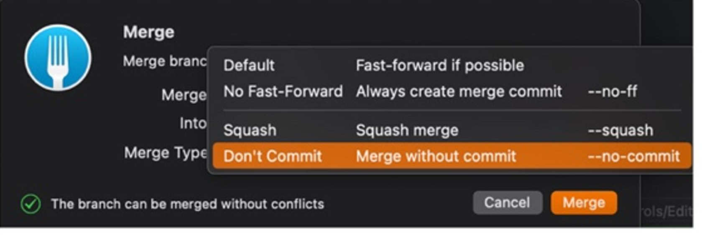

## 1. Reset 복원방법
::: tip
푸시된 커밋을 이전으로 되돌리고 싶을경우 
:::

### 1) commit log 조회

```
git log --oneline
```

`HEAD` 가 있는 커밋이 현재 브랜치를 가리키는 포인터이자 가장 최근의 커밋을 가리킨다.

### 2) reset

복구시키고 싶은 커밋의 id를 복사해놓고 `git reset`을 실행하자.

```
git reset --hard "commit ID"
```

- `-hard` 옵션을 사용하면 복구시키려는 커밋 이후의 모든 내용은 지워버린다.

다시 커밋 로그를 조회하면 해당 커밋 위의 커밋들은 사라져있다.

### 3) github 수습하기

```
git push -f origin <branch>
```

깃허브 커밋 이력을 확인하면 깔끔하게 지워졌다.

- `f` 옵션은 함부로 사용하면 안된다. 커밋과 푸시는 항상 신중하게 하도록 하자.

## 2. Fork로 복원

::: tip
복원시 해당 브랜치 이전이 뭔지 찾아서 reset해야함 **
그 전거 바로 reset 하면 남의 브랜치에 있는 내용을 가져올 수 있음
:::

1. 해당 브랜치로 들어가서 원하는 곳에 reset ‘브랜치’ to Here
    
    soft 일 경우 올린 커밋 unstage로 가져올수있다.
    
    hard 일 경우 올린 커밋 안가져와짐
    
   
    
2. 그리고 적용한 뒤 코드에 `git push -f origin` 브랜치 해야 적용됨.


## 3. Fork로 머지
1. commit메시지가 보이게 설정 하고 싶다면 `No fast foward` 를 하게 되면 커밋과 동시에 머지가 되서 메시가 보이게 된다.

   