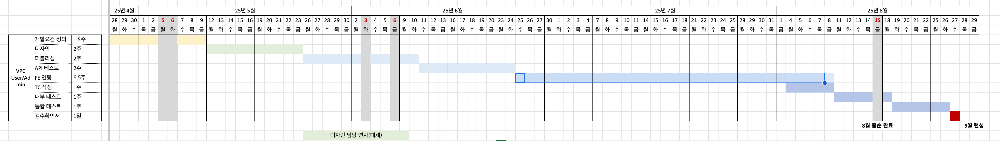

### - 일정

- #### USER

| Depth1                                        | Depth2                                           | Depth3                                                        | Depth4              |
| --------------------------------------------- | ------------------------------------------------ | ------------------------------------------------------------- | ------------------- |
| <b>서비스</b> | <b>hCloud VPC</b> | <b>Dashboard</b>             | (1)                 |
|                                               |                                                  | <b>Virtual Private Cloud</b> | VPC(4)              |
|                                               |                                                  | -                                                             | Subnet(4)           |
|                                               |                                                  | -                                                             | Interface(4)        |
|                                               |                                                  | -                                                             | Internet Gateway(5) |
|                                               |                                                  | -                                                             | NAT Gateway(5)      |
|                                               |                                                  | -                                                             | VPC Peering(5)      |
|                                               |                                                  | <b>Security</b>              | Network ACL(5)      |
|                                               |                                                  | -                                                             | Security Group(5)   |
|                                               |                                                  | <b>Traffic Management</b>    | Log Backend(5)      |
|                                               |                                                  | -                                                             | Flow Log(5)         |

- #### ADMIN

| Depth1                                            | Depth2                                           | Depth3                                                        | Depth4 |
| ------------------------------------------------- | ------------------------------------------------ | ------------------------------------------------------------- | ------ |
| <b>공통관리</b>   | <b>Tutorial</b>   | <b>Audit</b>                | (1)    |
| -                                                 | -                                                | <b>Admin 권한 관리 </b>     | (1)    |
| <b>게시판관리</b> | <b>공지사항</b>   | <b>탭</b>                   | (1)    |
| -                                                 | -                                                | <b>생성</b>                 | (1)    |
| <b>리소스관리</b> | <b>hCloud VPC</b> | <b>Openstack Project</b>    | (5)    |
| -                                                 | -                                                | <b>External Network</b>     | (5)    |
| -                                                 | -                                                | <b>Admin VPC</b>            | (5)    |
| -                                                 | -                                                | <b>User VPC</b>             | (5)    |
| -                                                 | -                                                | <b>Floating IP</b>          | (5)    |
| -                                                 | -                                                | <b>Admin Security Group</b> | (5)    |
| -                                                 | -                                                | <b>QoS</b>                  | (5)    |

- #### USER ( 운영 )
  | Depth1                                        | Depth2                                          | Depth3                                              | Depth4      |
  | --------------------------------------------- | ----------------------------------------------- | --------------------------------------------------- | ----------- |
  | <b>공통</b>   | <b>Tutorial</b>  |                                                     | (1)         |
  | <b>서비스</b> | <b>Help</b>      | <b>FAQ</b>         | (1)         |
  |                                               | -                                               | <b>User Manual</b> | (1)         |
  |                                               | <b>Dashboard</b> | -                                                   | (1)         |
  |                                               | <b>LNB</b>       | -                                                   | (1)         |
  |                                               | <b>HCS</b>       | <b>Server</b>      | Instance(5) |
  |                                               | <b>HKS</b>       | <b>Cluster</b>     | (5)         |
  |                                               | <b>HLB</b>       | <b>CLB</b>         | (5)         |
