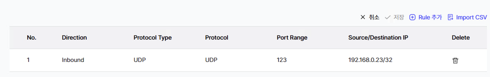
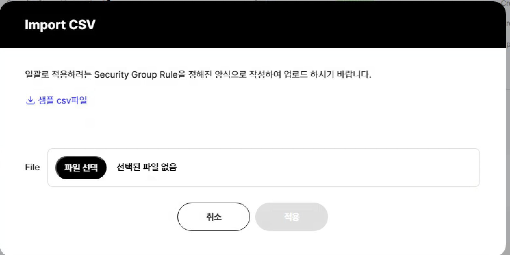

## HCS > Import CSV

### - 형식에 맞게 자동으로 엑셀 넣어주기

> 팝업, csv 다운로드는 기본 input download로 진행하였음.
> 업로드시 형식에 맞게 업로드 되게 하였고, 형식에 맞지 않는 코드가 있으면 에러 팝업을 띄움





```js{4}
// hcs/network/secgrp
const fileUpload = async (file) => {
  const data = await uploadCsv(file)
  fileUploadData.value = data
}
const applyExcel = () => {
  csvPopup.isOpen = false
  rulesRead.value = false
  const ValidationCsvProtoypeCheck = fileUploadData.value.every((item) => {
    if (item['Protocol Type'] === '') return false
    return securityGroupRule.some((items) =>
      items.protocolType.includes(item['Protocol Type']),
    )
  })
  ValidationCsvProtoypeCheck ? addRow(true) : (csvPopup.isError = true)
  fileUploadData.value = []
}
```

```js{4}
// utils/uploadCsv.js
export const uploadCsv = async (event) => {
  return new Promise((resolve, reject) => {
    if (event) {
      const file = event.target.files[0]
      const reader = new FileReader()
      reader.onload = (e) => {
        const items = e.target.result
          .split('\r\n')
          .map((item) =>
            item.replace(/"[^"]*"/g, (match) =>
              match.replace(/,/g, '##comma##'),
            ),
          )
          .map((item) => item.split(','))
          .filter((arr) => !arr.every((element) => element === ''))
          .map((item) => item.map((col) => col.replace(/##comma##/g, ',')))
        const headers = items[0]
        items.splice(0, 1)
        const data = items.map((item) =>
          item.reduce((acc, col, i) => ({ ...acc, [headers[i]]: col }), {}),
        )
        resolve(data)
      }
      reader.onerror = (error) => {
        reject(error)
      }
      reader.readAsText(file, 'utf-8')
    }
  })
}
```
