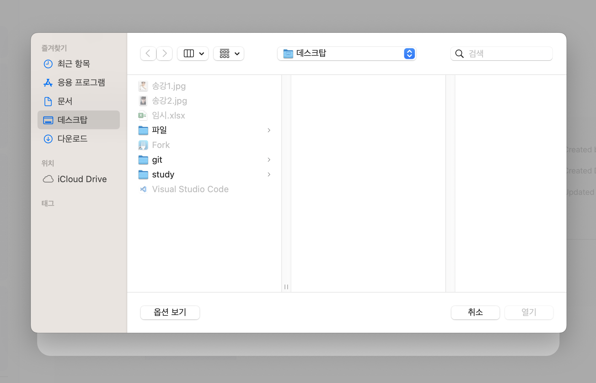
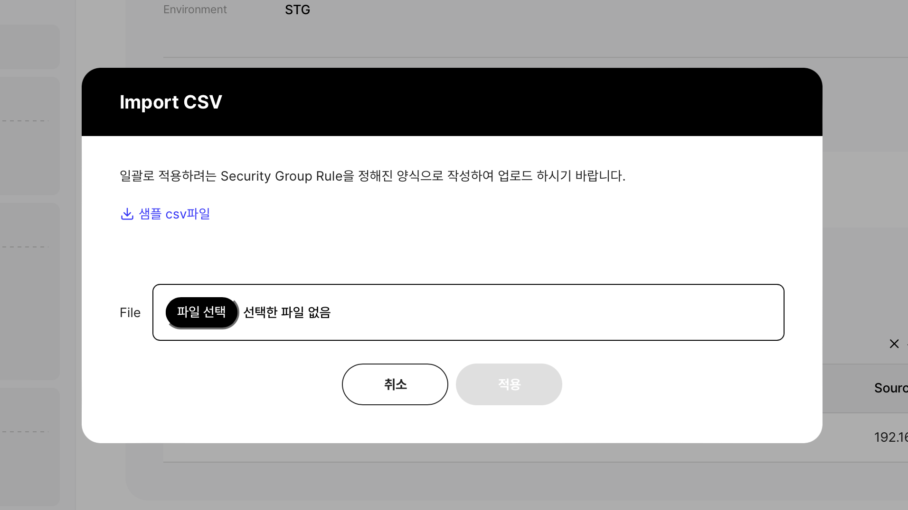
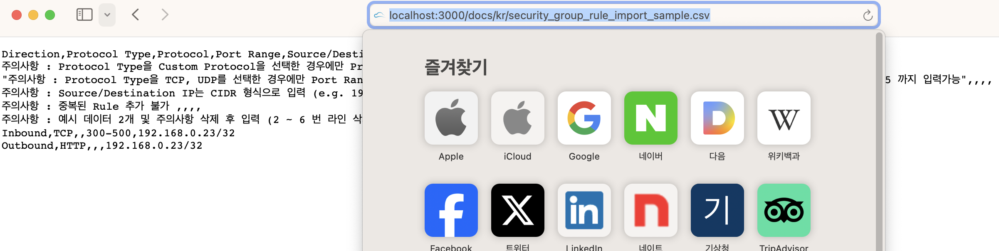

## Input 태그 버그문제
::: tip
- Input 태그는 사파리에서 호환이 되지 않는다.
:::

1. 크롬 기준 아래와 같이 사진상에서 봤을 때 
- 업로드를 클릭시 파일을 선택할 수 있게 잘 눌리는 걸 확인 할 수 있다.
  
   

2) 사파리 기준 아래와 같이 사진상에서 봤을 때
- 파일 선택이 안되고, 샘플 csv 파일 을 선택시 다운이 안되는 버그가 발생 하고 있다.

  
  