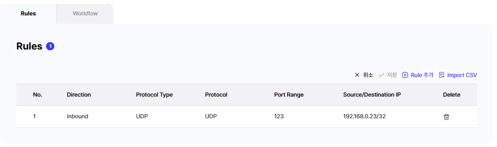
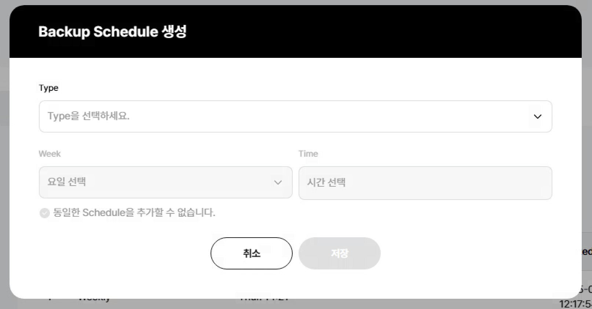

## 중복값 찾기 유효성검사

::: tip

- 배열안의 객체 순서가 바뀌기 때문에 깊게 검사를 해야함
  :::



#### 1) HCS > 중복값 (javascript 사용)

-> <b> 요구사항 </b>

- Rules 들의 중복 체크

-> <b> 문제점 </b>

- Rules 들의 중복체크가 안됨

-> <b>why?</b>

- 자동으로 필터링 되어 등록되면서 배열의 위치가 바뀌는 현상 발생
  이를 해결하기 위하여, 깊은 복사를 통해 중복체크를 진행

```js{4}
export default {
   {
      id: 'item4',
      code: useDirective(() => {
        const updatedArr = tableRules.items.map((item) => {
          if (item.protocolType === 'ICMP' || item.protocolType === 'Custom Protocol') {
            return {
              ...item,
              delete: '',
              portRange: '-',
              direction: item.direction,
            }
          } else {
            return {
              ...item,
              delete: '',
              portRange: /-/.test(item.portRange) ? item.portRange : Number(item.portRange),
              direction: item.direction,
            }
          }
        })
        const filterdArr = updatedArr.map(({ portRangeDisabled, protocolDisabled, _dynamic, _initial, ...value }) => value)

        //깊게 동일한지 검사하기
        const deepEqual = (obj1, obj2) => {
          if (obj1 === obj2) return true
          if (typeof obj1 !== 'object' || obj1 === null || typeof obj2 !== 'object' || obj2 === null) return false
          const keys1 = Object.keys(obj1)
          const keys2 = Object.keys(obj2)
          if (keys1.length !== keys2.length) return false
          for (const key of keys1) {
            if (!keys2.includes(key) || !deepEqual(obj1[key], obj2[key])) {
              return false
            }
          }
          return true
        }

        function isArrayUnique(arr) {
          return arr.every((item, index) => !arr.find((otherItem, otherIndex) => otherIndex !== index && deepEqual(item, otherItem)))
        }

        const result = isArrayUnique(filterdArr)
        return result
      }, true),
      message: t('hcs_error_duplicated_rule'),
    },
}
```

#### 2) HKS > CLuster 중복값 (lodash 사용)

-> <b> 요구사항 </b>

- WORKER POOL 들의 중복 체크

-> <b> 문제점 </b>

- WORKER POOL 들의 중복체크가 안됨

-> <b>why?</b>

- 위와 다르게 lodash를 이용하여 간단하게 처리하였음.


```js{4}
import { isEqual } from 'lodash'

watch(
  [
    () => modelData.description,
    () => tableCapiNode,
    () => modelData.projectNetworkIsolationLabel,
  ],
  ([description, nodeItems, networkIsolation]) => {
    const vmKey = ['id', '_initial', 'added', 'new', 'reservationId']
    const metalKey = [
      'id',
      '_initial',
      'added',
      'new',
      'zone',
      'flavor',
      'osId',
    ]
    nextTick(() => {
      const nodeItemsClone = nodeItems.items.map((item) => {
        const keyFilter = item.serverType === 'VM' ? vmKey : metalKey
        return Object.keys(item)
          .filter((key) => !keyFilter.includes(key))
          .reduce((obj, key) => {
            obj[key === 'role' ? 'worker' : key] =
              key === 'role'
                ? true
                : key === 'count'
                  ? Number(item[key])
                  : item[key]
            return obj
          }, {})
      })
      isChangeClusterItems.value.change = [
        isChangeClusterItems.value.description !== description,
        !isEqual(isChangeClusterItems.value.nodeItems, nodeItemsClone),
        isChangeClusterItems.value.networkIsolation !== networkIsolation,
      ].some((status) => status)
    })
  },
  { deep: true },
)
```

#### 3) HRDS > Backup Schedule 생성 중복값 (내부 정의된 duplicateDetector 함수 사용)

-> <b> 요구사항 </b>

- Type, Week, Time의 중복값 체크

-> <b> 문제점 </b>

- 기존의 리스트와 비교를 해야하는 상황

-> <b>why?</b>

- 기존에 정의 되어있는 함수 사용



```js{4}
{
      id: 'valid2',
      code: useDirective(() => {
        const array = tableAccessRule.items.map((item) => {
          return {
            direction: item.direction,
            protocol: item.protocol,
            port: item.port,
            sourceIp: item.sourceIp,
          }
        })
        return duplicateDetector(array)
      }, true),
      message: t('hcs_error_duplicated_rule'),
    }
```

```js{4}
// 테이블 유효성 검사 중복 체크
export const duplicateDetector = (arr) => {
  const object = arr.reduce((acc, obj) => {
    if (
      !Object.values(obj).some((value) => value === '') &&
      !Object.values(obj).some((value) => value === null)
    ) {
      const key = JSON.stringify(obj)
      acc[key] = (acc[key] || 0) + 1
    }
    return acc
  }, {})
  const result = Object.values(object).some((count) => count > 1)
  return !result
}
```

::: tip
결론,

- 배열을 깊게 중복 체크하려면, loadash를 활용하면 좋다.
  :::
