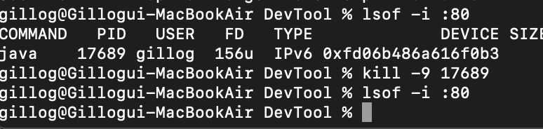

## 사용중인 port 죽이기, port kill


### - lsof -i :portnum
`lsof -i :portnum` 명령어로 사용중인 해당 Port의 `PID`를 확인할 수 있다. 

```
gillog@Gillogui-MacBookAir DevTool % lsof -i :80
COMMAND   PID   USER   FD   TYPE             DEVICE SIZE/OFF NODE NAME
java    17689 gillog  156u  IPv6 0xfd06b486a616f0b3      0t0  TCP *:http (LISTEN)
```

### - kill -9 portnum
`kil -9 portnum` 명령어로 해당 `PID`의 Process를 종료할 수 있다.

```
gillog@Gillogui-MacBookAir DevTool % kill -9 17689
```
