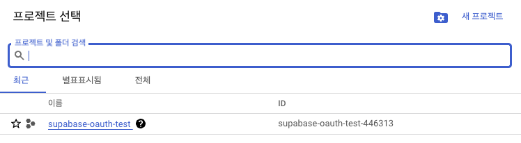

## Google Cloud에서 API 및 서비스 설정하기

Google Cloud에서 API 및 서비스 설정하기
Google Cloud로 가서 OAuth 관련 API 관련 설정을 해야 하는데요.

굉장히 복잡합니다.

아래와 같이 쭉 따라서 하시면 됩니다.

Google Cloud는 console.cloud.google.com 여기로 가시면 됩니다.


위와 같이 왼쪽 상단에 "프로젝트 선택" 버튼을 클릭해서 아래와 같이 프로젝트 선택 창이 뜨면 오른쪽 상단에 "새 프로젝트" 버튼을 눌러 새로운 프로젝트를 만들면 됩니다.


그러면 아래와 같이 프로젝트 이름을 적고 "만들기" 버튼을 누르면 됩니다.

적당한 프로젝트 이름을 적으시면 됩니다.


그러면 아래와 같이 프로젝트가 하나 생기는데요. 이제 방금 만든 프로젝트 이름을 클릭합니다.



이제 Google Cloud 메인 화면에서 왼쪽 최상단 햄버거 메뉴를 누르면 아래와 같이 나오는데요.


여기서 "API 및 서비스" 메뉴를 선택하면 작은 창에 "OAuth 동의화면" 메뉴가 나옵니다.

이걸 클릭합니다. 그러면 아래와 같이 나오는데요.

User Type을 내부 유저인지 외부 유저인지 설정해 줘야 하는데요.

이게 뭔 뜻이냐면 구글 클라우드는 비지니스 상대로 하기 때문에 조직을 설정해서 운영할 수 있습니다.

예를 들어 회사라고 하면 회사원들은 내부 유저가 되는 것이고 일반 고개들은 외부 유저가 되는 거죠.

우리의 경우 구글 아이디만 있으면 로그인할 수 있게 하기 위해 외부 유저타입을 누르고 "만들기" 버튼을 누릅니다.


이제 아래와 같이 나오면 간단하게 앱 정보 및 사용자 이메일을 적으면 됩니다.

여기서 사용자는 개발자를 지칭합니다.


이제 아래쪽으로 이동하면 "승인된 도메인" 섹션이 보이는데요.

"+ 도메인 추가" 버튼을 누릅니다.


승인된 도메인은 아래와 같이 Supabase 대시보드로 가서 세팅 메뉴로 가면 우리가 만들었던 앱의 프로젝트 URL이 아래와 같이 보이는데요.

이걸 구글 클라우드의 승인된 도메인에 추가하면 됩니다.


여기서 주의하실 점은 https를 빼고 적으시면 됩니다.


이제 아래로 조금 이동하면 개발자 연락처 정보를 남기게 되는데요.

아래와 같이 이메일 주소를 적어주면 됩니다.


이제 밑에 "저장 후 계속" 버튼을 누르면 1단계가 끝나게 되는데요.

아래와 같은 화면이 보이게 됩니다.


위와 같이 나오면 "범위 추가 또는 삭제" 버튼을 눌러 OAuth 동의 화면의 범위를 정해줘야 합니다.

보통 아래와 같이 3가지를 선택하면 됩니다.


보통 선택하는 게 "email", "profile", "openid" 입니다.

이제 밑에 "업데이트" 버튼을 눌러 업데이트하면 아래와 같이 방금 선택한 범위가 나옵니다.


그러면 아래와 같이 세 번째 단계가 완료됐다고 나오면서 테스트 사용자 관련 화면이 나오는데요.


추가로 테스트 사용자를 지정할 필요가 없어 맨 밑에 있는 "저장 후 계속" 버튼을 한 번 더 누릅니다.

그러면 아래와 같이 최종 결과가 나옵니다.


여기서 "대시보드로 돌아가기" 버튼을 누르면 됩니다.

이제 다시 왼쪽 "API 및 서비스" 메뉴에서 "사용자 인증 정보" 메뉴를 누릅니다.


위 그림과 같이 아무것도 설정되어 있지 않다고 나오는데요.

여기서 우리가 설정할 거는 바로 OAuth 2.0 클라이언트 ID 부분입니다.

중간 위쪽에 "+ 사용자 인증 정보 만들기" 버튼을 누르면 아래와 같이 나옵니다.
여기서 "OAuth 클라이언트 ID"를 선택해서 클릭합니다.


여기서 "OAuth 클라이언트 ID"를 선택해서 클릭합니다.


위와 같이 나오는데요.

애플리케이션 유형과 이름을 적어주고, 아래쪽에 있는 승인된 Javascript 원본 부분에 URI를 현재 개발하고 있는 개발서버주소를 적어주면 됩니다.

나중에 실제로 앱을 배포하면 배포 앱의 URI를 적으면 됩니다.

Next.js는 개발서버가 **`http://localhost:3000`** 입니다.

이제 Supabase 대시보드의 Authentication 부분으로 갑니다.


여기서 아래와 같이 "Auth Providers" 부분을 누르는데요.


여기서 많은 Providers에서 Google 쪽을 클릭합니다.


그러면 아래와 같이 현재 Enable 쪽에 체크가 안 되어 있는데 체크하시면 됩니다.


위 그림의 마지막에 보시면 "Callback URL (for OAuth)" 칸에 주소가 보이는데요.

이 주소를 구글 클라우드 쪽으로 가서 아래와 같이 "승인된 리디렉션 URI"칸에 넣으시면 됩니다.


이제 아래와 같이 Supabase 쪽 대시보드에서 마지막으로 "Save" 버튼을 누르면 됩니다.


이제 아래와 같이 구글 클라우드 쪽에서도 "만들기" 버튼을 누르면 됩니다.


그러면 아래와 같이 "클라이언트 ID"와 "클라이언트 보안 비밀번호"가 만들어지는데요.

이 두 개를 Supabase 대시보드에 옮겨 놓으면 됩니다.


Supabase 대시보드에 아래와 같이 "Client IDs"와 "Client Secrets" 부분에 옮겨 놓고 맨 밑에 "Save" 버튼을 한 번 더 눌러주시면 저장됩니다.


구글 클라우드에서도 팝업 창을 종료하면 아래와 같이 프로젝트 이름과 클라이언트 ID 등 관련 정보가 잘 저장되었다고 나옵니다.


위와 같이 구글 OAuth 설정과 Supabase 연동까지가 끝났는데요.

이제 실제 Next.js 코드를 작성해서 SignIn, SignOut 등 유저 로그인을 구현해 보겠습니다.

## Sign In 코드 작성하기

이제 실제 코드를 작성해 보겠습니다.

app 폴더 밑에 auth 폴더를 만들고 page.tsx 파일을 만들겠습니다.

```js{4}
import AuthForm from "@/components/Forms/AuthForm";

const AuthPage = () => {
  return (
    <div className="flex flex-col mx-auto gap-4 p-8">
      <h1>Not Logged in</h1>
      <AuthForm />
    </div>
  );
};

export default AuthPage;
```

위와 같이 일단은 auth 라우팅에는 간단하게 "Not Logged in"이라고 써놓고 그 밑에 AuthForm을 컴포넌트로 넣었는데요.

이제 이 AuthForm 컴포넌트를 만들어보겠습니다.

src 폴더 밑에 components 폴더를 만들고 Forms 폴더를 만들고 그 밑에 실제 파일인 AuthForm.tsx 파일을 만들겠습니다.

```js{4}
"use client";

import { signInWithGoogle } from "@/utils/supabase/actions";

const AuthForm = () => {
return (
<div>
<form>
<button
          formAction={signInWithGoogle}
          className="border rounded px-2.5 py-2"
        >
Sign in with Google
</button>
</form>
</div>
);
};

export default AuthForm;
```

위와 같이 AuthForm을 만들었습니다.

'use client' 디렉디브로 클라이언트 컴포넌트로 만들었고, form과 formAction을 지정했습니다.

Next.js에서 이제는 form을 POST 메서드 방식으로 전달하게 되는데요.

formAction 함수에 'signInWithGoogle' 액션 함수를 넣었습니다.

이제 이 함수를 만들어볼까요?

supabase 관련 클라이언트 코드를 모아 두었던 'utils/supabase' 폴더 밑에 actions 함수를 아래와 같이 만들겠습니다.

그리고 'utils/supabase' 폴더에서 지난 시간에 만들었던 server.ts 파일에서 createClient 함수 이름을 서버라는 걸 더 명확히 하기 위해 'createClientForServer'라는 이름으로 바꾸겠습니다.

```js{4}
"use server";

import { Provider } from "@supabase/supabase-js";
import { createClientForServer } from "./server";
import { redirect } from "next/navigation";

const signInWith = (provider: Provider) => async () => {
const supabase = await createClientForServer();

const auth_callback_url = `${process.env.SITE_URL}/auth/callback`;

const { data, error } = await supabase.auth.signInWithOAuth({
provider,
options: {
redirectTo: auth_callback_url,
},
});

console.log(data);

if (error) {
console.log(error);
}

redirect(data.url as string);
};

const signInWithGoogle = signInWith("google");

export { signInWithGoogle };
```

나중을 위해 signInWith 함수를 먼저 만들고 signInWithGoogle 함수를 최종적으로 만들어서 export 했습니다.

이제 signInWith 함수를 뜯어보아야 할 건데요.

OAuth 방식은 모두 다 위와 같은 식으로 처리하면 됩니다.

OAuth 방식은 예전에 제가 썼던 [Hono + Cloudflare 로그인 구현](https://mycodings.fly.dev/blog/2024-07-21-cloudflare-hono-google-login) 하는 글을 보시면 OAuth 방식의 처리에 대한 상세한 설명이 나오는데요.

일단 위와 같이 만들고 나서 Sign in Google 버튼을 누르면 실제로 코드가 작동하면서 아래와 같이 나오는데요.


위와 같이 구글 계정을 선택하라고 나오는데요.

제 아이디를 선택하면 아래와 같이 또 나옵니다.


다시 한번 "계속" 버튼을 누르면 구글 아이디를 이용해서 로그인 프로세스를 진행한다는 의미입니다.

"계속" 버튼을 누르면 브라우저가 아래와 같이 나오는데요.


```js{4}
http://localhost:3000/auth/callback?code=9eee6307-9ed4-498f-9eac-a8ab2d72de2e
```

위와 같이 우리가 아까 actions.ts 파일안에서 설정한 'auth_callback_url'로 이동했는데요.

그냥 이동한 게 아니라 URL 파라미터로 code 값을 같이 전달했습니다.

그리고 실제 'console.log' 명령어에 의해 콘솔창에 나오는 'data' 값을 한번 보셔야 하는데요.


위와 같이 data 값에는 provider 값과 url 값이 있는데요.

요지는 구글 아이디로 로그인하는 버튼을 누르면 supabase.auth.signInWithOAuth 함수에서 위 그림과 같이 콜백 URL을 리턴해주는데요.

해당 콜백 URL로 redirect 해야 합니다.

여기서 중요한 거는 바로 'code' 값인데요.

이 'code' 값을 이용해서 나중에 우리가 만들게 될 콜백 함수에서 실제 구글에서 제공해 주는 토큰값을 가져올 수 있게 됩니다.

그러면 우리가 'SITE_URL'을 '.env.local'에 먼저 저장합시다.

일단은 개발 서버이기 때문에 아래와 같이 만들고, 실제 웹 애플리케이션을 배포했을 때는 실제 URL로 바꾸시면 됩니다.

```js{4}
SITE_URL=http://localhost:3000
```

그러면 우리가 처리해 줘야 하는 콜백 함수를 만들어야 하는데요.

우리가 actions.ts 파일에서 설정한 'auth_callback_url'을 직접 구현해 줘야 합니다.

먼저, auth_callback_url이 '/auth/callback' 라우팅이라 app 폴더 밑에 auth 폴더가 있고 그 밑에 다시 callback 폴더를 만들고 page.tsx 파일을 만드는 게 아니라 route.ts 파일을 만들어야 합니다.

라우팅만 처리하면 되기 때문에 route.ts 파일 이름으로 해야 합니다.

```js{4}
import { NextRequest, NextResponse } from "next/server";

import { createClientForServer } from "@/utils/supabase/server";

export async function GET(request: NextRequest) {
  const { searchParams, origin } = new URL(request.url);
  const code = searchParams.get("code");
  const next = searchParams.get("next") ?? "/";

  if (code) {
    const supabase = await createClientForServer();
    const { error } = await supabase.auth.exchangeCodeForSession(code);
    if (!error) {
      const forwardedHost = request.headers.get("x-forwarded-host");
      const isLocalEnv = process.env.NODE_ENV === "development";
      if (isLocalEnv) {
        return NextResponse.redirect(`${origin}${next}`);
      } else if (forwardedHost) {
        return NextResponse.redirect(`https://${forwardedHost}${next}`);
      } else {
        return NextResponse.redirect(`${origin}${next}`);
      }
    }
  }

  return NextResponse.redirect(`${origin}/auth/auth-code-error`);
}
```

위 코드의 핵심은 바로 **supabase.auth.exchangeCodeForSession(code)** 함수인데요.

code 값을 넣으면 Auth 액세스 토큰을 리턴해 줍니다.

이제 개발 서버를 다시 돌려서 테스트해보면 구글 아이디로 로그인하면 최종적으로 "/" 라우팅으로 가게 됩니다.

로그인이 성공했다는 뜻입니다.

이제 "/" 라우팅에서 유저 로그인 상태를 브라우저에 나타내 봅시다.

## 유저 로그인 여부 파악하기

일단 Home 라우팅인 app 폴더 밑의 page.tsx 파일을 고쳐보겠습니다.

```js{4}
import { createClientForServer } from "@/utils/supabase/server";

export default async function Home() {
  const supabase = await createClientForServer();

  const session = await supabase.auth.getUser();

  console.log(session);

  return (
    <div className="flex flex-col py-4">
      Home
    </div>
  );
}
```

위와 같이 일단 우리가 만든 supabase 클라이언트를 불러주고 그다음 getUser 함수를 호출해서 세션 정보를 얻습니다.

console.log를 통해 터미널상에 어떻게 나타나는지 보겠습니다.

```js{4}
{
  data: {
    user: {
      id: '2bc007d5-~~~~~~~~~~00d7ced07',
      aud: 'authenticated',
      role: 'authenticated',
      email: 'cpro95@gmail.com',
      email_confirmed_at: '2025-01-01T04:29:04.395201Z',
      phone: '',
      confirmed_at: '2025-01-01T04:29:04.395201Z',
      last_sign_in_at: '2025-01-01T06:05:10.290278Z',
      app_metadata: [Object],
      user_metadata: [Object],
      identities: [Array],
      created_at: '2025-01-01T04:29:04.363282Z',
      updated_at: '2025-01-01T06:05:10.30955Z',
      is_anonymous: false
    }
  },
  error: null
}
```

session 객체는 data와 error 값이 있고, data 값에 user 값이 있어 getUser에 의해 user 정보를 얻을 수 있습니다.

여기까지만 해도 구글 아이디로 Supabase 로그인은 성공한 겁니다.

참고로 브라우저 개발 콘솔창에서 보시면 user 객체에 있는 app_metadata와 user_metadata를 상세히 볼 수 있습니다.

유저 메타데이터로 홈 화면을 멋있게 구성하고 Sign Out 버튼도 만들어 보겠습니다.

```js{4}
import { signOut } from "@/utils/supabase/actions";
import { createClientForServer } from "@/utils/supabase/server";
import Link from "next/link";

export default async function Home() {
  const supabase = await createClientForServer();

  const session = await supabase.auth.getUser();

  if (!session.data.user) {
    return (
      <div className="flex flex-col items-center justify-center h-screen gap-4">
        <h1 className="text-4xl font-bold">Not Authenticated</h1>
        <Link className="border rounded px-2.5 py-2" href="/auth">
          Sign in
        </Link>
      </div>
    );
  }

  const {
    data: {
      user: { user_metadata, app_metadata },
    },
  } = session;

  const { email } = user_metadata;

  const Email = email ? `${email}` : "email Not Set";

  console.log(session);
  return (
    <div className="flex flex-col gap-4">
      <p className="text-xl">Email: {Email}</p>

      <form action={signOut}>
        <button className="border rounded px-2.5 py-2" type="submit">
          Sign Out
        </button>
      </form>
    </div>
  );
}
```


위와 같이 브라우저에 아주 잘 나오고 있습니다.

이제 로그아웃을 위한 signOut 액션 함수를 만들어야 하는데요.

아까 만들었던 actions.ts 파일에 아래와 같이 추가하시면 됩니다.

const signOut = async () => {
const supabase = await createClientForServer();
await supabase.auth.signOut();
};

export { signInWithGoogle, signOut };
signOut 함수도 supabase에서 제공해 주고 있습니다.

"Sign Out" 버튼을 누르면 로그아웃되어 아래와 같이 보일 겁니다.


성공적으로 로그아웃 되었습니다.

지금까지 Supabase와 Google 아이디를 이용해서 로그인을 구현해 봤는데요.

다음 시간에는 Github 아이디를 이용한 로그인을 테스트해 보겠습니다.

그럼.
