## 1. 구글 클라우드 플랫폼에 앱 등록

```
https://console.cloud.google.com/auth/overview?inv=1&invt=Abrnyg&project=chatting-app-453302
```

### 구글 클라우드 플랫폼 계정을 생성하고 설정을 진행해보자.

- 구글 클라우드 플랫폼 > 콘솔 > API 및 서비스 > 사용자 인증 정보 접속

구글 프로젝트 생성 후 생성한 프로젝트로 이동
Project Name : My Next App

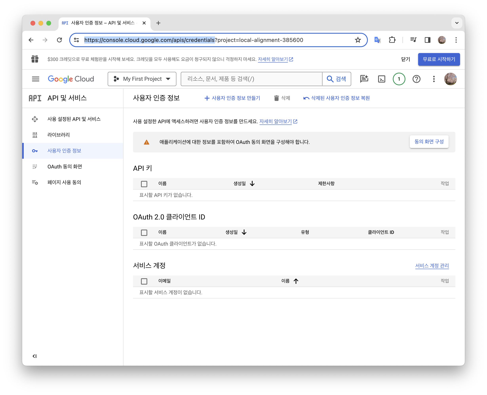

### 구글 프로젝트 생성 후 생성한 프로젝트로 이동

- Project Name : My Next App

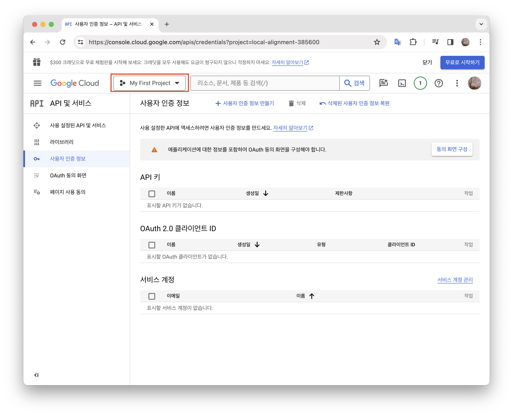
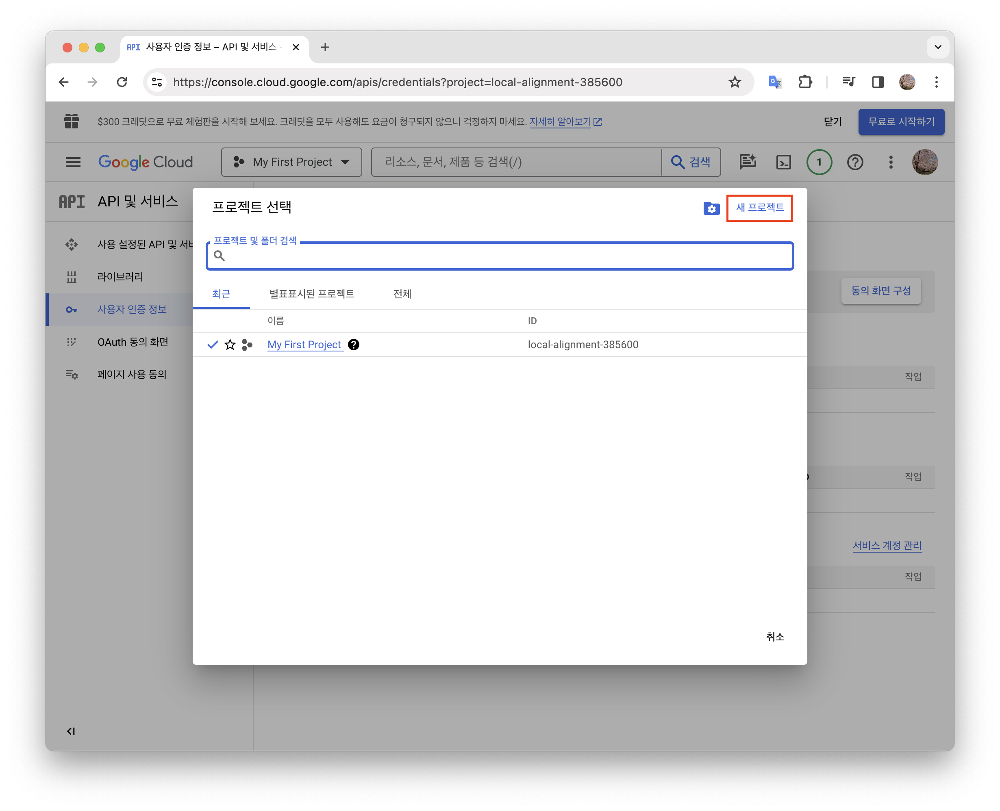
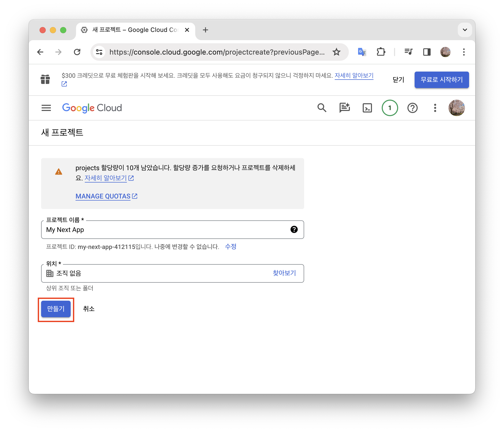
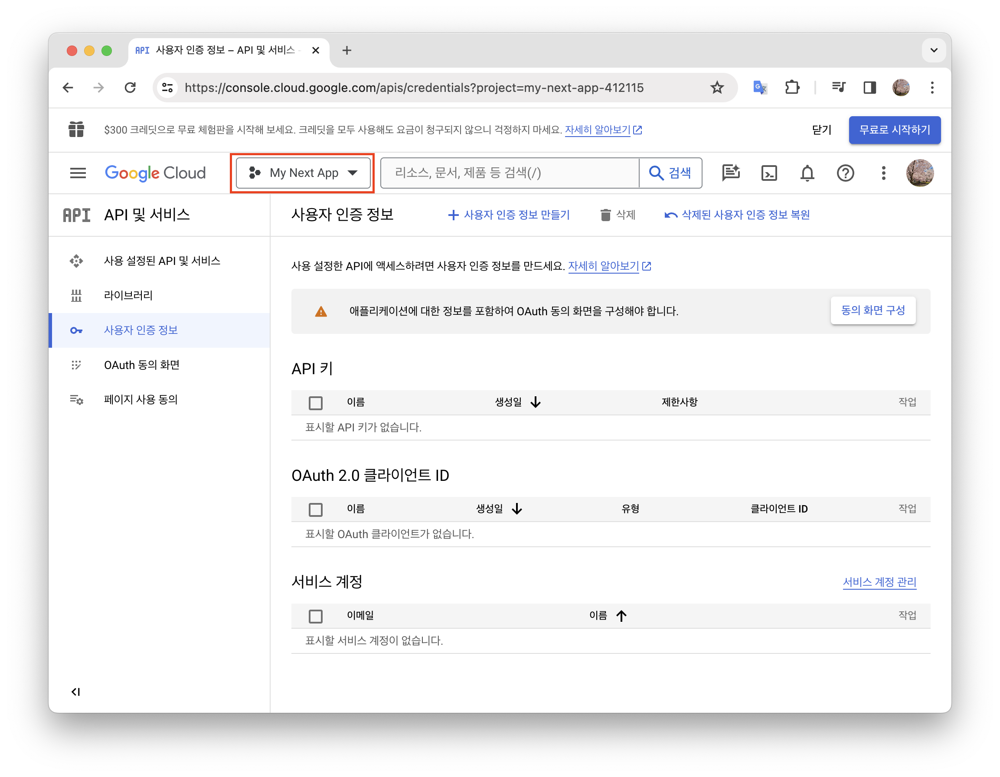

### OAuth 동의 화면 설정

- User Type : 외부 (누구나 구글을 통해 로그인할 수 있는 공개 웹사이트)

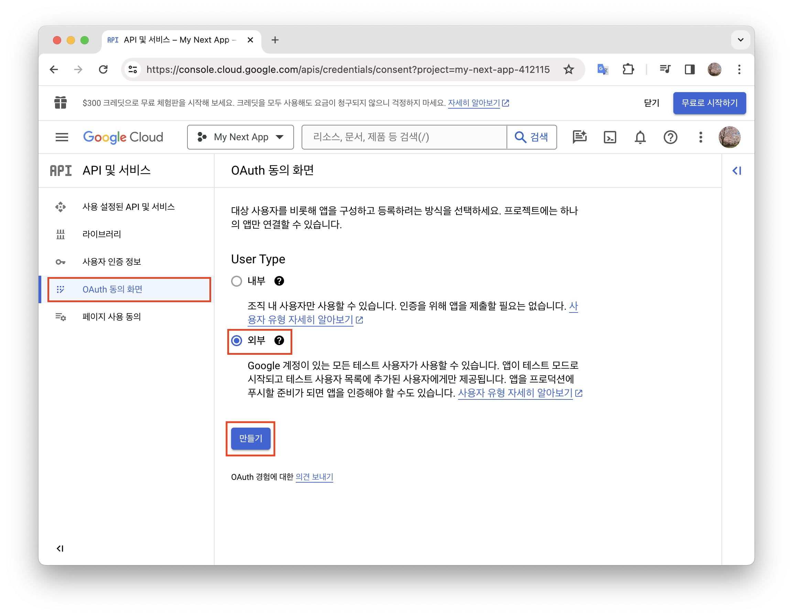

### 앱 등록 수정

- OAuth 동의 화면 - 필수 항목 (앱 이름, 사용자 지원 이메일) 입력

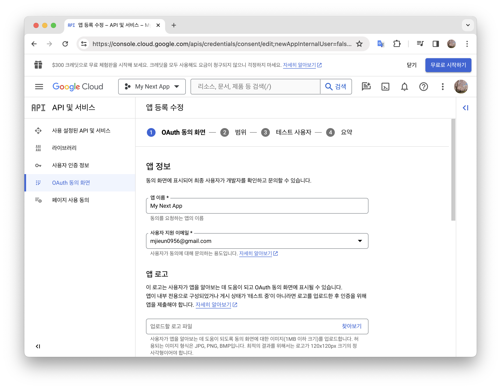

- 범위 - 저장 후 계속

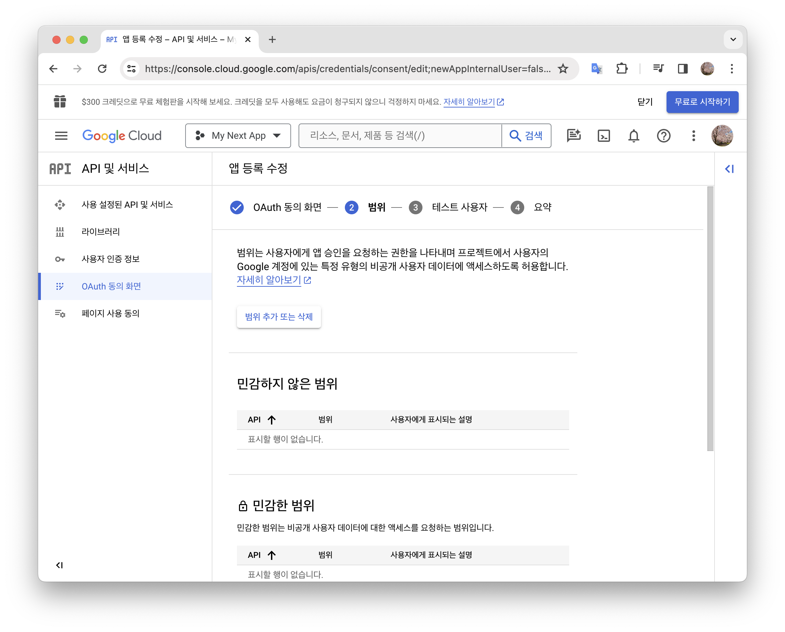

- 테스트 사용자 - ADD USERS 버튼 눌러 사용자 지원 이메일 추가

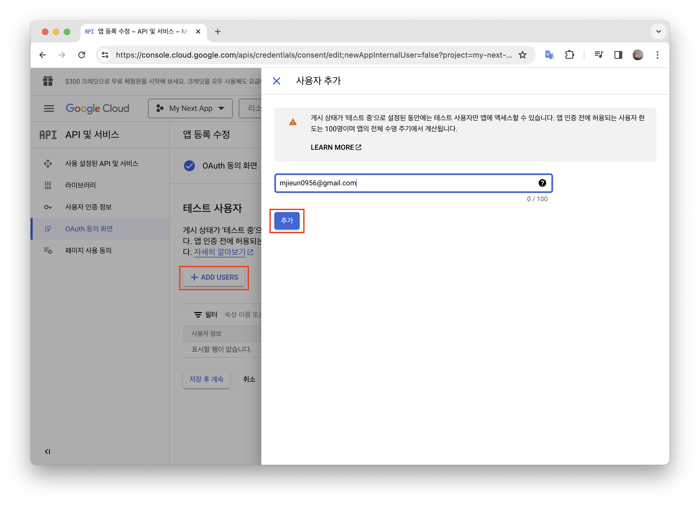

- 요약 - 내용 확인 후 대시보드로 돌아가기

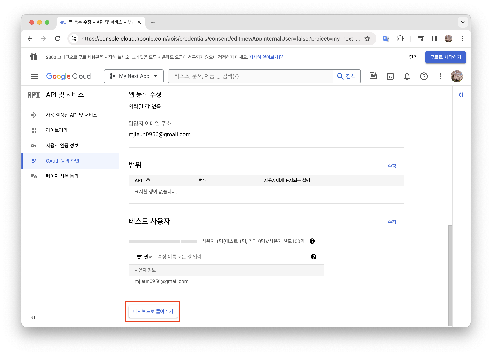

### OAuth Client ID 생성

- OAuth ?
  Open Authentication 의 약자로 구글, 페이스북, 트위터 등에서 사용되는 표준 인증 프로토콜
  사용자가 구글을 통해 로그인 하려는 경우, 애플리케이션은 사용자를 구글로 리디렉션하고 이후 구글에서 제공되는 인증 절차를 통해 사용자를 식별
  정상 식별된 경우 애플리케이션에 정상 식별되었다는 응답 전달
- 좌측 사용자 인증 정보 탭에서 OAuth Client ID를 생성해보자.

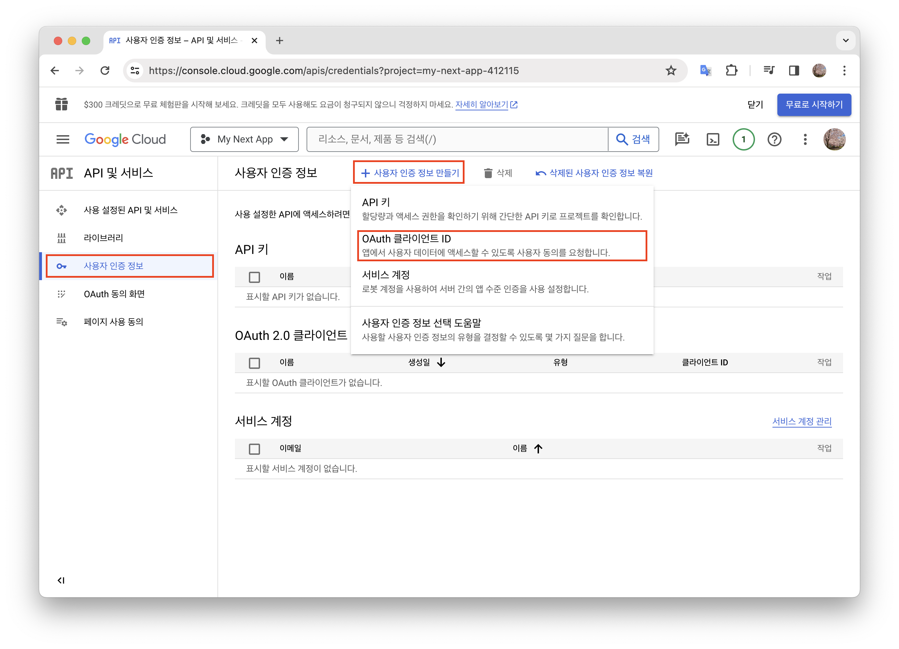

- 아래 항목 입력 후 OAuth Client ID 생성
  - 애플리케이션 유형 : 웹 애플리케이션
  - 앱 이름 : My Next App
  - 승인된 자바스크립트 원본 : 프로젝트 루트 경로 ( 여기서는 **`http://localhost:3000`**)
  - 승인된 리디렉션 URI : 구글 인증 리다이렉트 경로
    - For production: **`https://{YOUR_DOMAIN}/api/auth/callback/google`**
    - For development: **`http://localhost:3000/api/auth/callback/google`**

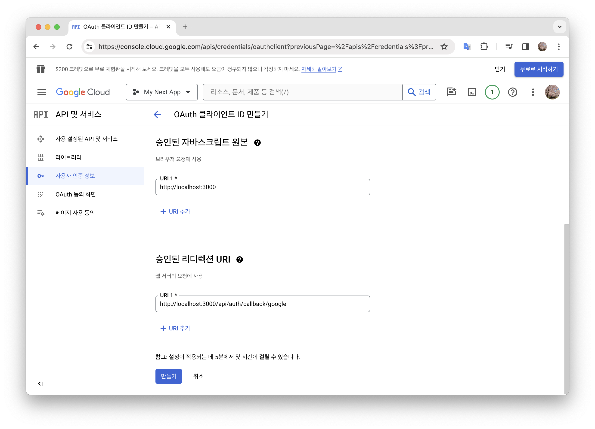

### 생성된 정보 환경 변수에 추가

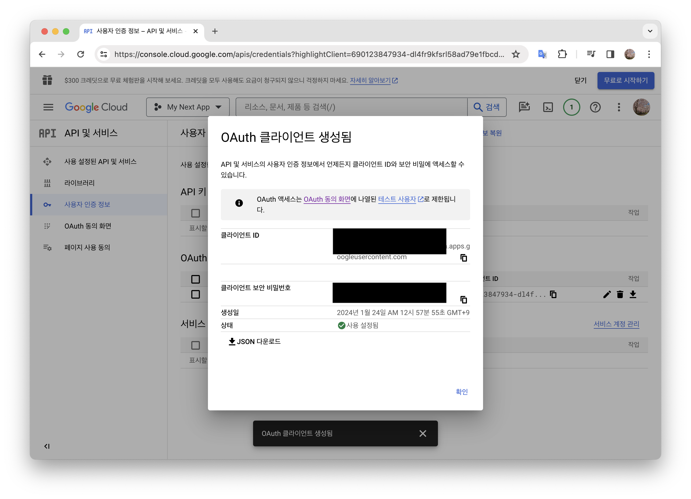

```
.env

GOOGLE_CLIENT_ID="YOUR CLIENT ID"
GOOGLE_CLIENT_SECRET="YOUR CLIENT SECRET"
```
