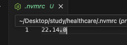

## 1. 설치하기

```
npm create cloudflare@latest 프로젝트명 -- --framework=next
```

## 2. node 버전 변경

```
1) .nvmrc 파일을 생성한다.
2) node -v 을 파일 안에 기재한다.
```



## 3. 보통 next에서 많이 사용하는 구조 및 라이브러리

- app 라우터 구조
- css 는 tailwind
