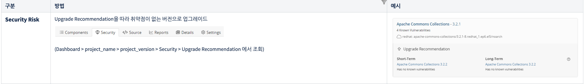

### Blackduck 정보

- 접속 주소: -
- 계정: -
- 프로젝트: -
- Version: -

--------------------------------------------------------

### 1. 처리 요청

- Security Risk – Critical, High(11건)
- License Risk - Critical, High(0 건)

 
--------------------------------------------------------

### 2. 처리 방법

1. java, jdk 설치
2. 환경변수 설정
3. synopsys-detect.jar 상위 폴더에 넣기
3. 아래의 코드와 같이 실행

> 실행시 주의 할 사항
> 노란색으로 칠한 부분은 변경 되어야 할 부분입니다.
 
- [프로젝트 특성 상 이미지를 공유 할 수 없음]

--------------------------------------------------------

### 3. 실행방법

gaia 코드 상위 폴더에 첨부 파일의 synopsys-detect.jar 복사

- 아래 코드를 gaia 코드 dir에서 실행
- 실행 결과는 Blackduck 콘솔 –> gaia-console 프로젝트 -> DFY version에서 확인 가능
- Java, mvn 이 설치되어 있어야 하며 아래 코드 중 --detect.maven.path에 mvn 경로 넣기

 
 

기타
- 변경이 불가한 경우는 사유 작성 부탁드립니다.
- Lib 버전 업그레이드 작업이라 영향도가 크기 때문에 꼼꼼한 테스트 부탁드리겠습니다.

