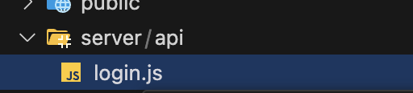

## 셋팅 전 버전 확인하기
> nuxt3
>
> tailwind
>
> vue3 버전: 3.4.34
>
> pinia
>
> node 버전 : 20.9.0 


--------------------------------------------------------

## 프로젝트 셋팅

#### 1. Nuxt3 설치

```
npx nuxi init project-name
```

#### 2. Tailwind Css 설치
1) Require and install the NuxtTailwind module by installing it via NPM:
```
npm install -D tailwindcss postcss autoprefixer
npx tailwindcss init
```


2) Configure the Nuxt configuration file to include the Tailwind module:
```
// nuxt.config.{js,ts} 
export default defineNuxtConfig({
  devtools: { enabled: true },
  postcss: {
    plugins: {
      tailwindcss: {},
      autoprefixer: {},
    },
  },
})
```

3) Create a `tailwind.config.ts` file by running the following command:
``` 
module.exports = {
  content: [
    "./components/**/*.{js,vue,ts}",
    "./layouts/**/*.vue",
    "./pages/**/*.vue",
    "./plugins/**/*.{js,ts}",
    "./app.vue",
    "./error.vue",
  ],
  theme: {
    extend: {},
  },
  plugins: [],
}
```

4) Create a new CSS file `./assets/css/main.css` and import the main Tailwind CSS directives:
```
tailwind base;
@tailwind components;
@tailwind utilities;
```

5) Set up the template paths for your Nuxt project inside the Tailwind CSS configuration file:
```
module.exports = {
  content: [
    "./components/**/*.{js,vue,ts}",
    "./layouts/**/*.vue",
    "./pages/**/*.vue",
    "./plugins/**/*.{js,ts}",
    "./nuxt.config.{js,ts}",
  ],
  theme: {
    extend: {},
  },
  plugins: [],
}
```


6) Add the Css file globally
```
export default defineNuxtConfig({
  devtools: { enabled: true },
  css: ['~/assets/css/main.css'],
  postcss: {
    plugins: {
      tailwindcss: {},
      autoprefixer: {},
    },
  },
})
```

- 설치 가이드 참고
https://tailwindcss.com/docs/installation


--------------------------------------------------------


#### 3. Pinia 설치

1) pinia nuxt 버전으로 설치해준다.
```
npm i @pinia/nuxt @pinia-plugin-persistedstate/nuxt
```

2) nuxt.config.{js,ts} 에 모듈을 등록해준다.
```
 modules: [ 
  '@nuxtjs/tailwindcss',
  '@pinia/nuxt',
  '@pinia-plugin-persistedstate/nuxt',
],
```
 
--------------------------------------------------------

## 로그인 구현
1) api 폴더 구조
 

<details>
<summary>코드 보기</summary>
  <div markdown="1">  
    ```js{4}
    import SpotifyWebApi from 'spotify-web-api-node';

    export default defineEventHandler(async (event) => {
        const body = await readBody(event);
        const code = body.code;
        console.log(code,"code")

        const spotifyApi = new SpotifyWebApi({
            redirectUri: 'http://localhost:3001',
            clientId: process.env.SPOTIFY_CLIENT_ID,
            clientSecret: process.env.SPOTIFY_CLIENT_SECRET,
        });

        try {
            const data = await spotifyApi.authorizationCodeGrant(code);
            return {
                accessToken: data.body.access_token,
                refreshToken: data.body.refresh_token,
                expiresIn: data.body.expires_in,
            };
        } catch (err) {
            throw createError({ statusCode: 400, message: 'Authentication failed' });
        }
    });
    ```
  </div>
</details>


2) axios plugin으로 만들기 

 `- /plugins/axios.js`
  ```js{4}
  import axios from 'axios'; 

  export default defineNuxtPlugin(nuxtApp => {
    const api = axios.create({
      baseURL: process.env.SPOTIFY_URL, 
      headers: {
        'Content-Type': 'application/json',
      },
    });

    nuxtApp.provide('axios', api);
  });
  ```

`- /components/Header.vue`
  ```js{4}
  const { $axios } = useNuxtApp()
   const result = await $axios.post('http://localhost:3001/api/login', {
      code: code
    })  
  ``` 


- 로그인 구현 시 참고
https://velog.io/@kimconut/%EC%8A%A4%ED%8F%AC%ED%8B%B0%ED%8C%8C%EC%9D%B4-api-%EB%A1%9C%EA%B7%B8%EC%9D%B8-%EA%B5%AC%ED%98%84%ED%95%98%EA%B8%B0


## API 연동
#### 1. Album

#### 2. Artist


- 페이지별 api 사용시 참고
https://developer.spotify.com/documentation/web-api/reference/get-an-artist

