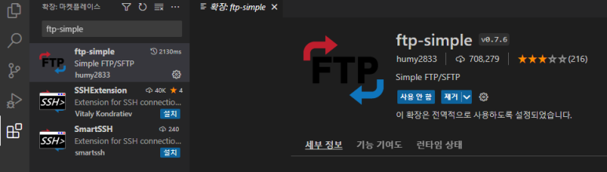
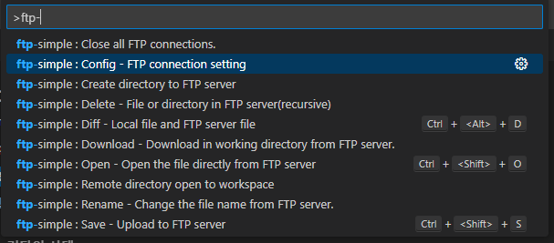
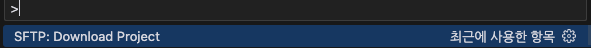

## Setting


#### 1. 기본적으로 VSC를 설치했다 가정하고 (네이버에 VISUAL STUDIO CODE 검색해서 설치하면 된다.) 실행을한다.
>>>>>>>
 


--------------------------------------------------------

#### 2. 확장 메뉴를 열고, ftp-simple을 검색해서 설치를 해주자. 
>>>>>>>
 
 


상단부 검색창에  ">ftp-" 까지만 검색하면 사진에서처럼 여러가지가 좌르륵 뜨는데, 그중에 "ftp-simple : config - FTP connection setting"를 선택해주자. 


```
{
    "name": "UNA",
    "host": "unacorp.ftp.cafe24.com",
    "protocol": "ftp",
    "port": 21,
    "username": "unacorp",
    "password": "asitis0621!",
    "remotePath": "/sde_design",
    "uploadOnSave": true,
    "useTempFile": false,
    "openSsh": false
}
```

그러면 이런창이 뜨는데, 다음과 같이 입력해주면 된다.
name,username : 홈페이지이름,아이디 등등 아무거나 입력해도 무방하다.
host : "cafe24아이디.cafe24.com" 형식으로 입력한다. (내 도메인 주소로 입력하면 안됨!)
port,type : 건들지말자.
password: 저번시간 설정했던 내 CAFE24 FTP 비밀번호를 입력하자.
path: 건들지말자
autosave : 자동저장의 여부 / confirm : 저장확인여부 : 취향껏 설정하자.

--------------------------------------------------------
​
### 3. 저장 및 실행
이렇게 입력을하고 Ctrl + s로 저장을 한 한 후 실행시켜준다
shift + cmd + p

 
