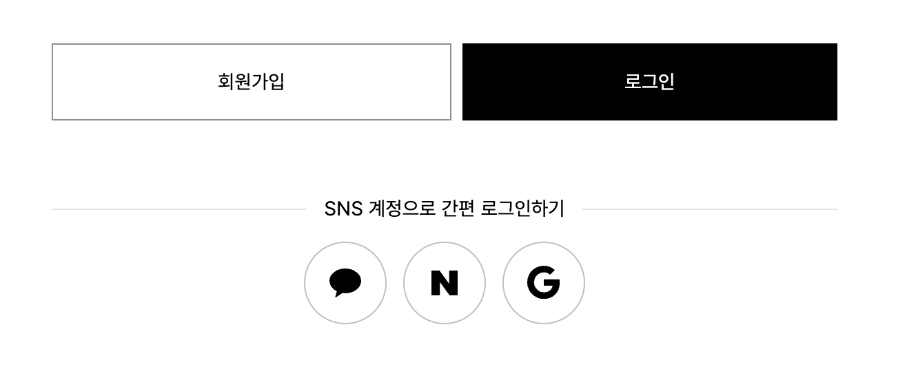
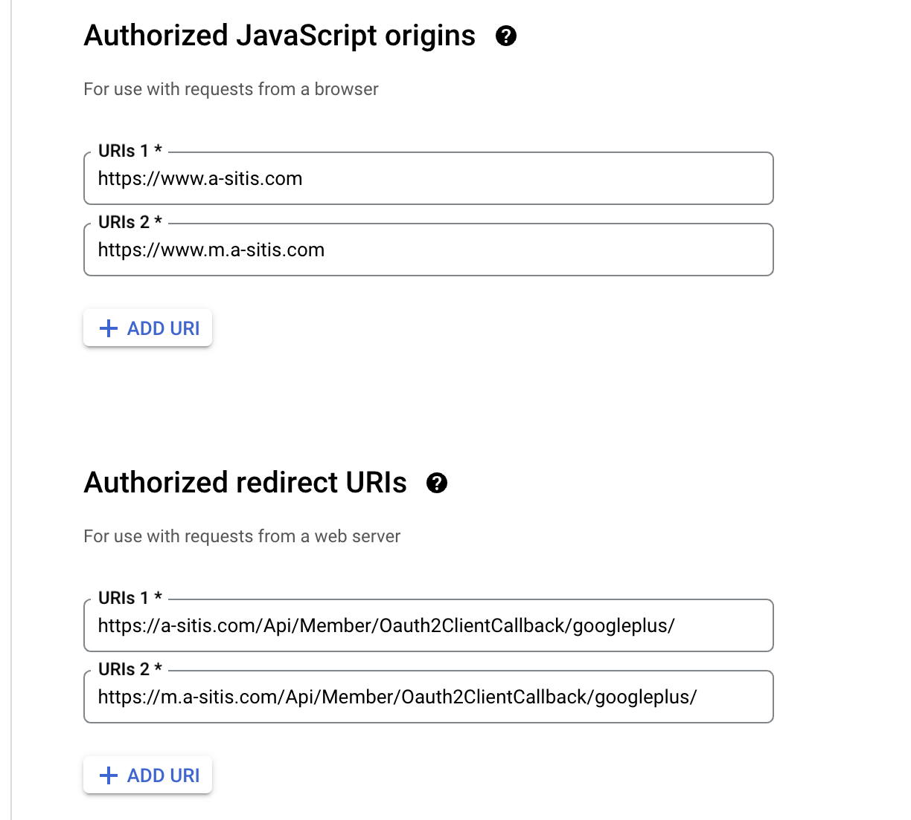

## 카카오톡, 구글, 네이버 연동 하면서의 문제사항 기록

 
>>>>>>>
 


#### 1. 구글 카페24와 연동하기
- 아래의 이미지와 같이 redirectURL 을 넣어야하며

- 개발자 url이 아닌 도메인 형태의 url로 들어가서 테스트를 해야 가능하다.
>>>>>>>
 


#### 2. 네이버 카페24와 연동하기
- 아래의 가이드 대로 신청하지 않을 경우 신청이 안될 수 가 있음.

https://developers.naver.com/docs/common/openapiguide/#/appregister.md


#### 3. 카카오 카페24와 연동하기 
카카오 api id를 넣어서 연결해야함.
```
<script src="https://t1.kakaocdn.net/kakao_js_sdk/2.7.2/kakao.min.js" integrity="sha384-TiCUE00h649CAMonG018J2ujOgDKW/kVWlChEuu4jK2vxfAAD0eZxzCKakxg55G4" crossorigin="anonymous"></script>
    
```
```
  function send_kakao_talk_url() {
    try {
      if (Kakao) { 
          Kakao.init("api id"); 
      }
    } catch(e) {};

    Kakao.Link.sendDefault({
      objectType : "feed",
      content : {
          title : "{$name|striptag}",
          description : "상품설명",
          imageUrl : "http:{$small_img}",                        
          imageWidth : 420,
          imageHeight : 300,                        
          link : {
              mobileWebUrl : "",
              webUrl : ""
          }
      },
      buttonTitle : "상품 보기",
    });
    $('.share-popup').remove();
  } 
  function copy_btn() { 
    const copyBtn = document.querySelector('#copyBtn')
    copyBtn.value = window.document.location.href;
    copyBtn.select();
    document.execCommand('copy');
    copyBtn.blur();
    alert('상품 링크가 복사되었습니다. 붙여넣기 하시면 됩니다.')
    $('.share-popup').remove();
  }
```
